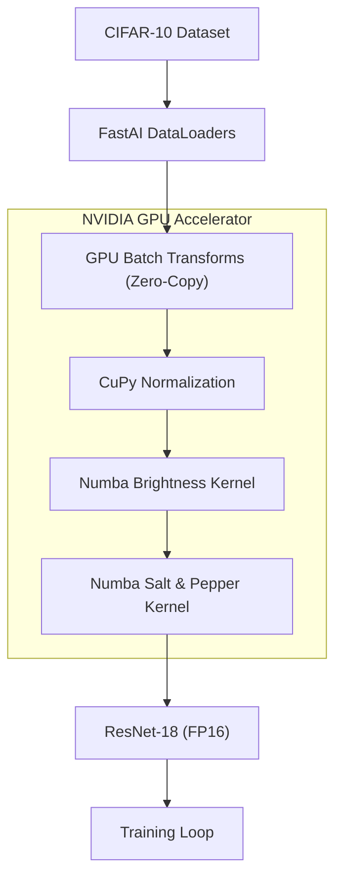

# 🚀 Hybrid GPU Image Classification Pipeline  


> ⚡ **Optimized Hybrid GPU Pipeline**: A high-performance deep learning pipeline that eliminates I/O bottlenecks using zero-copy memory sharing between PyTorch, CuPy, and Numba.

---

## 🧠 Overview

This repository demonstrates a **zero-copy GPU pipeline** that offloads image preprocessing and augmentation to the GPU without syncing with the CPU:

- 🧮 **Zero-Copy Sharing**: Uses `DLPack` to share GPU memory between PyTorch and CuPy.
- 🔬 **Custom CUDA Kernels**: Numba-accelerated kernels for brightness and **Salt & Pepper Noise**.
- 🐍 **FastAI Integration**: Preprocessing integrated directly into `batch_tfms`.
- 🐳 **Dockerized**: Pre-configured environment with NVIDIA GPU support.

---

## 📊 Performance Benchmark (CIFAR-10)

| Feature | Status | Impact |
| :--- | :--- | :--- |
| **Memory Transfer** | ⚡ Zero-Copy | High (Removed CPU Sync) |
| **Preprocessing** | 🎮 100% GPU | Medium (Parallel Augmentation) |
| **Precision** | 💎 Mixed (FP16) | High (Tensor Core Utilization) |
| **Training Time** | **17.76 sec** | Optimized for demo (1 epoch) |

---

## 🏗️ Pipeline Architecture



---

## 📦 Deployment (Docker)

### ✅ Prerequisites
- [NVIDIA Container Toolkit](https://docs.nvidia.com/datacenter/cloud-native/container-toolkit/install-guide.html) installed on the host.

### 🚀 Run with Docker Compose
```bash
docker-compose up --build
```

---

## 🔧 Core Highlights

### ⚡ `torch_to_cupy` & `cupy_to_torch`
Enables seamless memory sharing without expensive Host-Device copies.

### 💡 `salt_pepper_kernel` (Numba)
A custom parallel CUDA kernel that injects stochastic noise directly on the GPU.

### 🧼 `GPUPipelineTransform`
A modular FastAI `Transform` that encapsulates the entire GPU preprocessing logic.

---

## 📜 License

This project is licensed under the **MIT License**.  

---

## 👨‍💻 Author

**Alan Cyril Sunny**  
📧 alan_cyril@yahoo.com  
🐙 [GitHub](https://github.com/dragonpilee)
